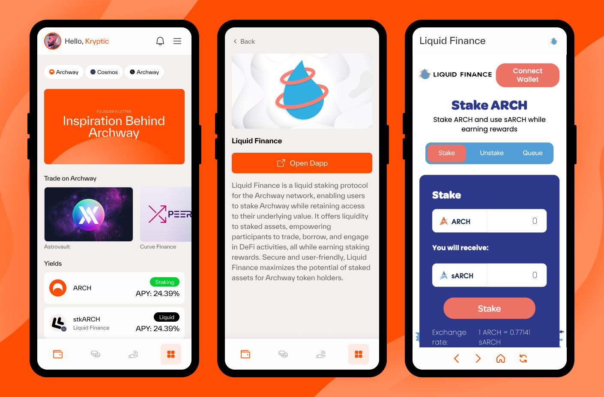

# ArchX Wallet Dapp Submission Guide


Welcome to the ArchX Wallet Dapp Submission Guide. By adding your Dapp to this directory, your Dapp will be `automatically pulled` into the mobile Dapp browser of ArchX Wallet, as seen in the example images below. The Dapp details, including the logo and description, will be `auto-populated` into the ArchX wallet. Dapps are `free to add themselves to or remove themselves` from this directory.

### Example Dapp Browser:



## Submission Steps

0. `Clone` the repository.
1. **`Create a folder`** for your Dapp in the root of the repository, following the format `Archway-Dapps/<my_project_name>`.
2. We need `2 dapp images`: a UI card banner and a centered logo. The banner card should have a `16:9 aspect ratio`, while the logo image should have a `1:1 aspect ratio`. In your Dapp folder, include the banner card and logo images.
3. Create a `details.json` file in your Dapp folder that follows our schema (refer to `schema.json`).
4. Fill out all the information in the `details.json` file according to the schema.
5. Create a Pull Request (PR) to this repository with your changes.

For a practical example of what your submission should look like, refer to the `Example-Dapp/` folder.

## Dapp Image Requirements

- Format: PNG or JPG (No SVG)
- Size: Minimum dimensions for UI card banner are 328px x 176px or an aspect ratio of 16:9. Minimum dimensions for the centered logo are 40px x 40px or an aspect ratio of 1:1.
- File name: Should match the `dappBanner` and `dappLogo` fields in the `details.json` file.

### Example Banner & Logo


## Supporting 'Connect with ArchX' in Your Project

We inject the same API as Keplr both at `window.keplr` and `window.archx`. Therefore, you can detect if a user is accessing your Dapp website from within our WebView in the ArchX wallet by checking for the existence of `window.archx`.

If `window.archx` exists, you can show the option for "Connect with ArchX". You can use any of the ArchX logo icons provided in the repository for this purpose.

### Example

```javascript
if (typeof window.archx !== "undefined") {
  // Show the option for "Connect with ArchX" and logo
  // Use window.keplr OR window.archx going forward both are the available.
}
```

The logo icons for ArchX are available in this repository under `ArchX-Logos/` directory. The logos are available in PNG and SVG format and in various colors.

## Review and Approval

We aim to review and merge PRs as quickly as possible. **Note, however, that part of our approval process involves evaluating the `mobile responsiveness` of your Dapp website. A good `mobile experience` is essential to our users, so any sites that do not function well on mobile devices may not be approved.**

Thank you for your interest in joining the ArchX Dapp directory. We look forward to reviewing your submission.
