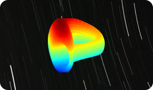

# ArchX Wallet Dapp Submission Guide


Welcome to the ArchX Wallet Dapp Submission Guide. Please follow the steps below to have your Dapp included in our list.

## Submission Steps

1. **Create a folder** for your Dapp in the root of the repository.
2. In your folder, create a `details.json` file that follows our schema (refer to `schema.json`).
3. Include your Dapp image in your folder. The image should have a minimum dimension of 328 x 176.
4. Fill out all the information in the `details.json` according to the schema.
5. Create a Pull Request (PR) to this repository with your changes.

For a practical example of what your submission should look like, refer to the `ExampleDapp` folder.

## Dapp Image Requirements

- Format: PNG or JPG
- Size: Minimum dimensions of 328px x 176px. Larger images should maintain the same aspect ratio.
- File name: Should match the `dappImage` field in the `details.json` file.

### Example Banner



## Supporting ArchX in Your Project

We inject the same API as Keplr both at `window.keplr` and `window.archx`. Therefore, you can detect if a user is accessing your Dapp website from within our WebView in the ArchX wallet by checking for the existence of `window.archx`.

If `window.archx` exists, you can show the option for "Connect with ArchX". You can use any of the ArchX logo icons provided in the repository for this purpose.

### Example

```javascript
if (typeof window.archx !== "undefined") {
  // Show the option for "Connect with ArchX" and logo
}
```

The logo icons for ArchX are available in this repository under `Logos/` directory. The logos are available in PNG and SVG format and in various colors.

## Review and Approval

We aim to review and merge PRs as quickly as possible. **Note, however, that part of our approval process involves evaluating the mobile responsiveness of your Dapp website. A good mobile experience is essential to our users, so any sites that do not function well on mobile devices may not be approved.**

Thank you for your interest in joining the ArchX Dapp directory. We look forward to reviewing your submission.
